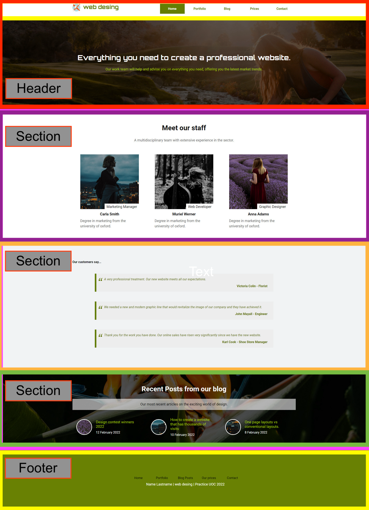
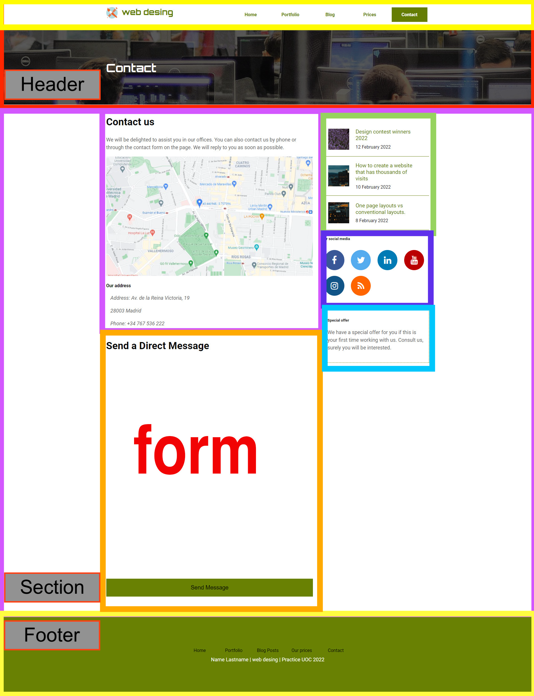

# Project documentation

## Introduction

The following images shows how to the planification was done to structure the website. Only are include the index.html and the contact.html, as the prices.html will have the same structure than the contact.html.

## Justification

The body default styles are reset, so it is easier to lay out our website and other generic properties, like font-size are applied.
All the headers are composed by a navbar and an image with a header.

## Deploy
Besides the FTP provided by UOC, the project is deployed in [rail way](https://railway.app/) and hosted in [GitHub](https://github.com/MarcServat/web-standard-pac1).

URL: https://nginx-production-efec.up.railway.app/
repo: https://github.com/MarcServat/web-standard-pac1

